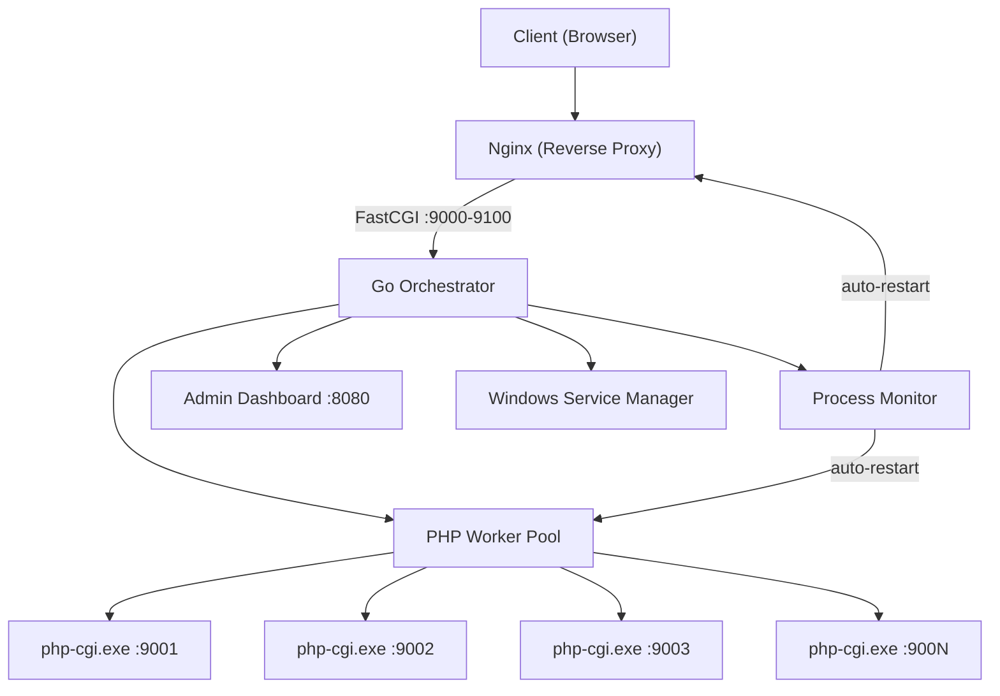

# GopherStack Enterprise — Implementation Plan

Solusi orchestrator infrastruktur web yang menjalankan stack **Nginx + PHP** di Windows Server menggunakan **Go** sebagai konduktor utama, dengan target PHP 8.2+.

---

## Arsitektur Tingkat Tinggi



---

## Proposed Changes

### Struktur Folder Proyek

```text
c:\Users\USER\Documents\project\web\exp\web_server\
├── go.mod
├── go.sum
├── main.go                          # Entry point + CLI
├── cmd/
│   └── gopherstack/
│       └── main.go                  # Alternative entry via cmd
├── internal/
│   ├── config/
│   │   ├── config.go                # Configuration struct & loader
│   │   └── defaults.go              # Default values
│   ├── orchestrator/
│   │   ├── orchestrator.go          # Main orchestrator lifecycle
│   │   └── signals.go               # OS signal handling
│   ├── pool/
│   │   ├── manager.go               # PHP worker pool manager
│   │   ├── worker.go                # Individual PHP-CGI worker
│   │   └── balancer.go              # Round-robin load balancer
│   ├── proxy/
│   │   └── fcgi_proxy.go            # FastCGI reverse proxy handler
│   ├── nginx/
│   │   ├── manager.go               # Nginx process lifecycle
│   │   └── config_gen.go            # Nginx config generator (text/template)
│   ├── monitor/
│   │   ├── monitor.go               # Health-check & auto-healing
│   │   └── metrics.go               # Metrics collection (CPU, mem, req/s)
│   ├── service/
│   │   └── windows_service.go       # Windows Service wrapper (kardianos/service)
│   └── dashboard/
│       ├── server.go                # HTTP server for admin dashboard
│       ├── api.go                   # REST API endpoints
│       └── static/                  # Embedded static assets (HTML/CSS/JS)
│           ├── index.html
│           ├── style.css
│           └── app.js
├── templates/
│   └── nginx.conf.tmpl              # Nginx config template
├── config/                          # Auto-generated runtime configs
├── www/                             # PHP document root
│   └── index.php                    # Default PHP info page
├── logs/                            # Log directory
└── bin/                             # Nginx & PHP binaries (user-provided)
    ├── nginx/
    └── php/
```

---

### Fase 1: Core Orchestrator (Process Manager & Signal Handling)

#### [NEW] go.mod
- Module: `gopherstack`
- Go version: 1.22+
- Dependencies:
  - `github.com/kardianos/service` — Windows Service wrapper
  - `github.com/yookoala/gofast` — FastCGI client/proxy
  - `go.uber.org/zap` — Structured logging
  - `github.com/shirou/gopsutil/v3` — System metrics (CPU, Memory)

#### [NEW] main.go
- CLI entry point dengan sub-commands: `start`, `stop`, `install`, `uninstall`, `status`, `version`
- Parsing flag: `--config`, `--workers`, `--port`
- Initialize config → Orchestrator → Run

#### [NEW] internal/config/config.go
```go
type Config struct {
    PHPBinaryPath    string  // Path to php-cgi.exe
    NginxBinaryPath  string  // Path to nginx.exe
    WorkerCount      int     // Number of PHP workers (default: CPU cores * 2)
    BasePort         int     // Starting port for PHP workers (default: 9001)
    MaxRequests      int     // Requests before worker recycle (default: 500)
    MaxMemoryMB      int     // Memory limit per worker in MB (default: 128)
    DocumentRoot     string  // PHP document root (default: ./www)
    NginxPort        int     // Nginx listen port (default: 80)
    DashboardPort    int     // Admin dashboard port (default: 8090)
    LogDir           string  // Log directory (default: ./logs)
}
```
- Loads from `config/gopherstack.json` with sane defaults
- Supports environment variable overrides

#### [NEW] internal/config/defaults.go
- Default values function
- Auto-detect CPU cores for worker count

#### [NEW] internal/setup/downloader.go
- Auto-download PHP & Nginx binaries saat pertama kali dijalankan
- PHP 8.5.6 NTS x64: `https://downloads.php.net/~windows/releases/archives/php-8.5.6-nts-Win32-vs17-x64.zip`
- Nginx 1.30.0 Stable: `https://nginx.org/download/nginx-1.30.0.zip`
- Download dengan progress bar, extract zip ke `bin/php/` dan `bin/nginx/`
- Skip download jika binary sudah ada
- Verify binary setelah extract (`php-cgi.exe --version`, `nginx.exe -v`)

#### [NEW] internal/pool/worker.go
- Struct `Worker` yang men-spawn satu instance `php-cgi.exe` pada port tertentu
- Menjalankan `php-cgi.exe -b 127.0.0.1:{port}` via `os/exec`
- Track: PID, port, request count, memory usage, status (idle/busy/dead)
- Method: `Start()`, `Stop()`, `Restart()`, `IsAlive()`, `RequestCount()`

#### [NEW] internal/pool/manager.go
- Struct `PoolManager` yang mengelola slice of `Worker`
- Dynamic scaling: `ScaleUp(n)`, `ScaleDown(n)`
- Worker recycling: setelah `MaxRequests` tercapai, restart worker
- Graceful shutdown: drain active connections before stopping

#### [NEW] internal/pool/balancer.go
- Round-robin load balancer untuk mendistribusikan request ke worker
- Method `NextWorker() *Worker` — skip dead workers
- Health-aware: hanya forward ke worker yang `IsAlive()`

#### [NEW] internal/proxy/fcgi_proxy.go
- HTTP handler yang menerima request dan forward ke PHP worker via FastCGI
- Menggunakan `github.com/yookoala/gofast` untuk FastCGI client
- Map HTTP request → FastCGI params (SCRIPT_FILENAME, DOCUMENT_ROOT, etc.)
- Connection pooling per worker

#### [NEW] internal/orchestrator/orchestrator.go
- Main lifecycle: `Init()` → `Start()` → `Run()` → `Stop()`
- Koordinasi antara: PoolManager, NginxManager, Monitor, Dashboard
- Graceful shutdown sequence

#### [NEW] internal/orchestrator/signals.go
- Handle `SIGINT`, `SIGTERM` untuk graceful shutdown
- Notify orchestrator to begin shutdown sequence

---

### Fase 2: Nginx Integration & Dynamic Config

#### [NEW] internal/nginx/manager.go
- Start/Stop/Reload nginx.exe
- Config validation via `nginx -t` sebelum reload
- Hot-reload support: `nginx -s reload`

#### [NEW] internal/nginx/config_gen.go
- Generate `nginx.conf` dari template menggunakan `text/template`
- Dynamic upstream block berdasarkan active workers
- Optimized settings untuk Windows (`worker_connections`, `sendfile off`, etc.)

#### [NEW] templates/nginx.conf.tmpl
```nginx
worker_processes auto;
events {
    worker_connections 1024;
}
http {
    upstream php_pool {
        {{range .Workers}}
        server 127.0.0.1:{{.Port}};
        {{end}}
    }
    server {
        listen {{.NginxPort}};
        root {{.DocumentRoot}};
        location / {
            try_files $uri $uri/ /index.php$is_args$args;
        }
        location ~ \.php$ {
            fastcgi_pass php_pool;
            fastcgi_param SCRIPT_FILENAME $document_root$fastcgi_script_name;
            include fastcgi_params;
        }
    }
}
```

---

### Fase 3: Windows Service & CLI

#### [NEW] internal/service/windows_service.go
- Implementasi `service.Interface` dari `kardianos/service`
- `Start()`: launch orchestrator dalam goroutine
- `Stop()`: trigger graceful shutdown
- Install/Uninstall service commands
- Auto-start saat boot (service type: automatic)

#### [UPDATE] main.go
- CLI sub-commands menggunakan flag parsing:
  - `gopherstack install` — install sebagai Windows Service
  - `gopherstack uninstall` — remove service
  - `gopherstack start` — start service/foreground
  - `gopherstack stop` — stop service
  - `gopherstack status` — tampilkan status workers, nginx, metrics
  - `gopherstack reload` — hot-reload config

---

### Fase 4: Admin Web Dashboard

#### [NEW] internal/dashboard/server.go
- Embedded HTTP server di port 8090
- Serve static files menggunakan `embed.FS`
- WebSocket endpoint untuk real-time metrics push

#### [NEW] internal/dashboard/api.go
REST API endpoints:
- `GET /api/status` — Overall system status
- `GET /api/workers` — List semua workers dengan metrics
- `POST /api/workers/scale` — Scale up/down workers
- `GET /api/metrics` — CPU, memory, request rate
- `GET /api/logs` — Recent log entries
- `POST /api/reload` — Trigger config reload
- `GET /ws/metrics` — WebSocket real-time metrics stream

#### [NEW] internal/dashboard/static/index.html
- Modern, premium admin dashboard UI
- Dark theme dengan glassmorphism effects
- Real-time charts untuk metrics
- Worker status cards dengan live indicators

#### [NEW] internal/dashboard/static/style.css
- Premium design system dengan CSS variables
- Dark mode, gradients, glassmorphism
- Responsive layout
- Micro-animations

#### [NEW] internal/dashboard/static/app.js
- WebSocket connection untuk real-time data
- Chart rendering (lightweight, no external deps)
- Worker management controls
- Auto-refresh metrics

---

### Fase 5: Monitoring & Auto-Healing

#### [NEW] internal/monitor/monitor.go
- Periodic health checks (configurable interval, default: 5s)
- Detect hung/crashed workers → auto-restart
- Detect nginx crash → auto-restart
- Memory threshold monitoring → recycle workers exceeding limit
- Alert via log when auto-healing occurs

#### [NEW] internal/monitor/metrics.go
- Collect per-worker metrics: request count, memory, CPU
- System-level metrics via `gopsutil`
- Expose metrics struct untuk dashboard consumption
- Historical metrics buffer (last 60 data points)

---

### Sample PHP Test Page

#### [NEW] www/index.php
```php
<?php
phpinfo();
```

---

## Dependensi Utama

| Package | Versi | Tujuan |
|:---|:---|:---|
| `github.com/kardianos/service` | latest | Windows Service management |
| `github.com/yookoala/gofast` | latest | FastCGI client proxy ke PHP |
| `go.uber.org/zap` | latest | Structured logging |
| `github.com/shirou/gopsutil/v3` | latest | System metrics (CPU, mem) |
| `github.com/gorilla/websocket` | latest | WebSocket untuk dashboard |

---

## User Review Required

> [!IMPORTANT]
> **PHP & Nginx Binaries**: GopherStack akan **otomatis mengunduh** PHP 8.5.6 NTS x64 dan Nginx 1.30.0 Stable saat pertama kali dijalankan. Binaries akan diekstrak ke `bin/php/` dan `bin/nginx/`.

> [!IMPORTANT]
> **Admin Dashboard Port**: Default port dashboard adalah `8090`. Pastikan port ini tidak digunakan oleh aplikasi lain.

## Open Questions

> [!NOTE]
> 1. **Auto-SSL (ACME)** — Fitur P2 ini akan diimplementasikan di iterasi berikutnya. Apakah anda ingin saya menyertakannya sekarang atau di fase terpisah?
> 2. **Request Throttling** — Apakah rate limiting ingin diimplementasikan di level Go proxy atau di Nginx config?
> 3. **TCP/IP Tuning** — Modifikasi Windows Registry (`TcpTimedWaitDelay`, `MaxUserPort`) memerlukan hak Administrator. Apakah ini harus dilakukan otomatis saat `install` atau manual?

---

## Verification Plan

### Automated Tests
1. **Unit Tests**: `go test ./...` untuk semua packages
2. **Build**: `go build -o gopherstack.exe .` — memastikan binary terkompilasi
3. **Config Generation**: Verify generated nginx.conf valid via `nginx -t`

### Manual Verification
1. Start GopherStack → verify PHP workers spawn pada port yang benar
2. Buka browser → akses `http://localhost` → verify `phpinfo()` page
3. Buka dashboard → akses `http://localhost:8080` → verify real-time metrics
4. Kill satu PHP worker → verify auto-restart oleh monitor
5. Install sebagai Windows Service → verify auto-start setelah reboot
